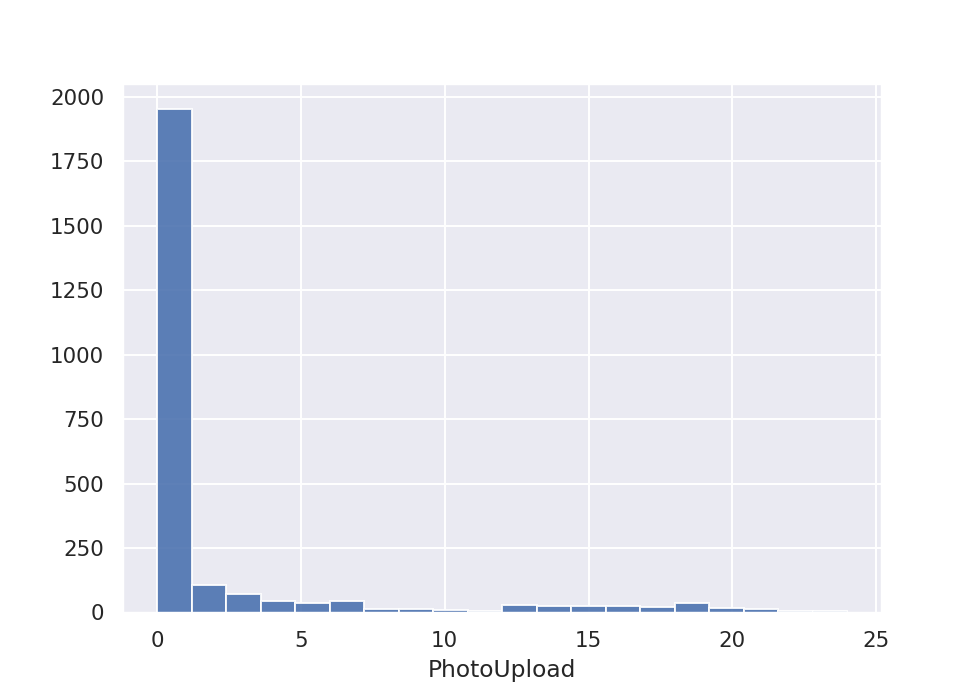

## Analysis of the PhotoUpload event

### Analysis process
The `PhotoUpload` event is one of four events that users trigger at GuideBook, which are `GuideSession`, `GuideDownload`, `ConnectionRequest` and `PhotoUpload`.

The analysis was done in two parts:
* **Part 1**: 
A script (`user_event_counts.py`) to keep track of how many times each user triggers each event. This script creates a json file (`event_counts.json`). In this file, each user id is a key and the corresponding value is a dictionary of events showing how many times they were triggered by that user.

* **Part 2**:
A Jupyter Notebook (`photo_upload_analysis.ipynb`) containing the analysis for the `PhotoUpload` event.

### Findings
The `PhotoUpload` event is not frequently triggered by users in this dataset.
  
More than 75% of the users have not triggered this event, as shown in the histogram below:

The average number of times a user has triggered it is `2`, while the highest number of times it has been triggered by one user is `24`.
  
These numbers, compared to the `GuideSession` event (over `49000` triggers), are very low.
  
However, when put into context with the other two event types (`GuideDownload` and `ConnectionRequest`), it is evident that `PhotoUpload` has been triggered more than the two other events and is in fact the second most triggered event after `GuideSession`.
  

### Conclusion
`PhotoUpload` is the second most triggered event by users in this dataset, but it is behind the most triggered event, `GuideSession` by a huge margin of over `40,000`.
